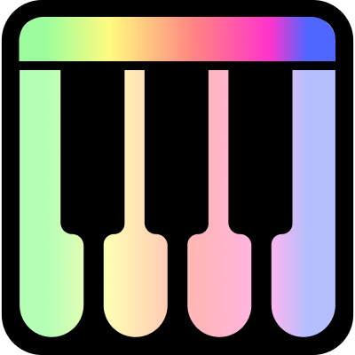
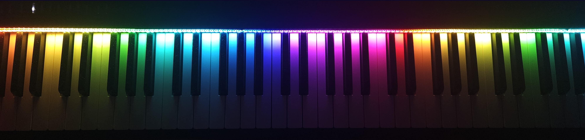
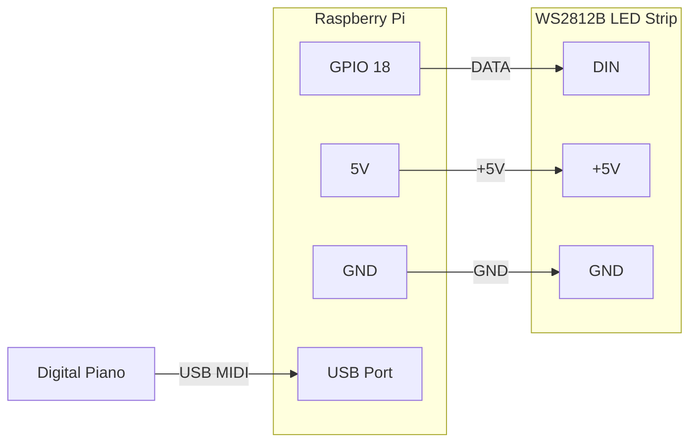

<p align="center">
  
</p>

<h1 align="center">LEDsplay</h1>

<p align="center"><strong>Turn your piano into an interactive LED learning system.</strong></p>


LEDsplay connects your digital piano to an LED strip via MIDI on a Raspberry Pi. Every key lights up in real time as you play. Learn songs, practice scales, play games - all controlled from a web app on your phone, tablet, or computer.

---

## Features

- 🎹 **Real-time LED visualization** - every key lights up instantly as you play *(free)*
- 🎨 **LED animations** - Rainbow, Sparkle, Gradient, Bubble, Tetris, Police and more *(free)*
- 🎵 **Song learning** - follow the lights, adjust tempo, practice hands separately, loop sections
- 🎼 **Sheet music display** - real notation in the browser with notes highlighted as you play
- 🎯 **Scales & note training** - all major scales with LED guides, 3 difficulty levels
- 🎮 **Piano games** - Reaction Game, Piano Battle (2-player), LED Keeper
- 📱 **Web interface** - control everything from your phone, tablet, or any browser

11 public domain demo songs included (Canon in D, Für Elise, Moonlight Sonata, and more). Upload your own MIDI/MusicXML files with the paid version.

---

## What it looks like

<p align="center">
  
</p>

<p align="center">
  
</p>

<!-- screenshot UI na telefonie -->

---

## Free vs Paid

The free version works forever - no time limit, no account needed.

| | Free | Paid (one-time) |
|---|:---:|:---:|
| Real-time key lighting | ✅ | ✅ |
| All LED animations | ✅ | ✅ |
| 11 demo songs | ✅ | ✅ |
| Upload your own songs (MIDI/MusicXML) | ❌ | ✅ |
| Sheet music display | ❌ | ✅ |
| Scale & note learning | ❌ | ✅ |
| Piano games | ❌ | ✅ |
| MIDI recording & playback | ❌ | ✅ |
| All future features | ❌ | ✅ |

**No subscription.** Pay once, own it forever. No monthly fees, no cloud dependency - LEDsplay runs entirely on your Raspberry Pi. Up to 3 devices per license.

**[→ Get LEDsplay](https://ledsplay.lemonsqueezy.com)** - 14-day free trial, no credit card needed

---

## What you need

### Hardware

| Part | Details | Est. cost |
|------|---------|-----------|
| Raspberry Pi | **Zero 2W** (fits the custom PCB/case) or **4B/5** (standalone setup) | $15–75 |
| WS2812B LED strip | 144 LEDs/m, individually addressable | $8–15 |
| Digital piano | Any with **USB MIDI** output (tested on Roland FP-30) | - |
| USB cable | Piano side: usually USB-B. Pi side: micro USB (Zero 2W) or USB-A (Pi 4/5) | $3–5 |
| Power supply | Depends on your Pi model and setup - see [Power & brightness](#power--brightness) | $5–15 |
| Jumper wires | 3 wires: GPIO 18 (data), 5V (power), GND (ground) | $1–2 |

**Estimated total (without piano): $50–110** depending on what you already have.

### Wiring

Connect 3 wires from the LED strip to the Raspberry Pi:

| LED strip | Raspberry Pi |
|-----------|-------------|
| DIN (data) | GPIO 18 |
| +5V | 5V |
| GND | GND |

Then connect your piano to any USB port.

<!-- MEDIA NEEDED: Photo or color pinout diagram of the physical wiring - which pins on the GPIO header,
     how the LED strip connector looks. Mermaid diagram below is kept as a reference but a real photo
     is much more useful for someone with a soldering iron. -->

<details>
<summary>Wiring diagram (schematic)</summary>



</details>

---

## Hardware compatibility

LEDsplay includes a custom PCB design and 3D-printable case sized for the Raspberry Pi Zero 2W - the most compact and affordable setup. The software runs on any Pi with WiFi: Zero 2W, 4B, and 5 are all tested and supported.

> **PCB design and 3D case files** are available with the paid version. See [Free vs Paid](#free-vs-paid).

Works with any digital piano that has USB MIDI output. Primary development and testing is done on a **Roland FP-30**.

---

## Installation

There are two ways to install LEDsplay:

---

### Option 1 - Script install
Install on any fresh Raspberry Pi OS. Works on all Pi models.

**1. Flash Raspberry Pi OS Lite** onto a microSD card. You can use [Raspberry Pi Imager](https://www.raspberrypi.com/software/) or any other tool. If using Raspberry Pi Imager, open the settings (gear icon) and configure:
- **Hostname:** `ledsplay` - this lets you reach the Pi at `ledsplay.local`
- **WiFi credentials** - so the Pi connects to your network on first boot
- **Enable SSH** - so you can log in remotely without a monitor

**2. Boot the Pi and connect via SSH:**

```bash
ssh pi@ledsplay.local
# or use the IP address assigned by your router
```

**3. Run the setup script:**

```bash
curl -fsSL https://raw.githubusercontent.com/PabloCSScobar/ledsplay/main/setup.sh | sudo bash
```

This downloads the latest release from GitHub, installs all dependencies, and configures the system. **On Raspberry Pi Zero 2W, setup takes ~15 minutes** - most of that is installing Python packages.

**4. Reboot** if prompted.

**5. Done.** If everything is connected correctly, the LED strip will show a startup animation. Open **http://ledsplay.local** in your browser to access the app.

<details>
<summary>What the installer does</summary>

- Downloads the latest release from GitHub
- Installs system dependencies (Python 3, GPIO libraries, MIDI tools)
- Sets up a Python virtual environment at `/opt/ledsplay/`
- Configures GPIO and SPI for LED control
- Pre-generates MusicXML cache for bundled demo songs
- Creates a systemd service (`ledsplay.service`) that starts on boot
- Full log at `/var/log/ledsplay-setup.log`

</details>

---

### Option 2 - Pre-built image

Download a ready-to-use system image - Raspberry Pi OS Lite with LEDsplay already installed. No SSH or terminal needed.

**1. Download the latest image** from the [Releases page](https://github.com/PabloCSScobar/ledsplay/releases/latest).

**2. Flash it** using [Raspberry Pi Imager](https://www.raspberrypi.com/software/): instead of choosing a system from the list, select **"Use custom"** and pick the downloaded image file.

**3. Boot the Raspberry Pi.** If everything is connected, the LED strip will show a startup animation.

**4. Connect to the LEDsplay hotspot** from your phone, tablet, or PC:

| | |
|---|---|
| **SSID** | `LEDsplay-Setup` |
| **Password** | `ledsplay` |

**5. Configure WiFi:** Open **http://ledsplay.local** in your browser. Tap the **More** icon at the bottom → go to **Network settings** → select your home WiFi network and connect. After a few seconds the `LEDsplay-Setup` hotspot will turn off and the Pi will join your network.

**6. Done.** Open **http://ledsplay.local** - you're in.

---

## Updating

Updates are available through the web interface: **System > Updates**.

The app checks for new releases from this repository and performs safe updates with automatic rollback.

<details>
<summary>Manual update</summary>

```bash
sudo /opt/ledsplay/venv/bin/python3 /opt/ledsplay/updater.py update
```

</details>

---

## Power & brightness

LEDsplay is designed to run on a single shared power supply for both the Raspberry Pi and the LED strip. Brightness is managed in software to stay within safe power limits:

- Key brightness: max 30%
- Background brightness: max 25%

These values provide vivid, clearly visible lighting while keeping power draw well within the supply's capacity.

---

## Service management

```bash
sudo systemctl status ledsplay.service     # Check status
sudo systemctl restart ledsplay.service    # Restart
sudo journalctl -u ledsplay.service -f     # View logs
```

---

## Status LEDs

LEDsplay supports 2 small indicator LEDs (GPIO pin 21) to show system state at a glance. They are optional - the app works without them.

| Color / animation | Meaning |
|---|---|
| 🔴 Red (solid) | System starting up |
| 🟢 Green (solid) | Ready - everything OK |
| 🔵 Blue (pulsing) | WiFi hotspot active - waiting for network setup |
| 🟡 Yellow (pulsing) | No MIDI device detected |
| 🟢🔵🟣 Cycling | LED animation or screensaver running |
| ⚫ Off | Status LEDs disabled in settings |

Color and brightness can be customised under **System > Status LEDs** in the app.

---

## Feedback & support

LEDsplay is actively developed - new features and fixes ship regularly. Found a bug or have an idea? [Open an issue](https://github.com/PabloCSScobar/ledsplay/issues) - I read everything and fix reported bugs fast.

Need support for another language? Open an issue - I'd love to add it. The app currently supports **English** and **Polish**.

---

## Tech stack

| Layer | Technology |
|-------|-----------|
| Hardware | Raspberry Pi + WS281x LED strip + MIDI USB |
| Backend | Python, Flask, SocketIO |
| Frontend | Angular + Ionic |
| Communication | WebSocket + REST API |

---

## License

LEDsplay is proprietary software. Free tier available at no cost. See [pricing](#free-vs-paid) for details.
