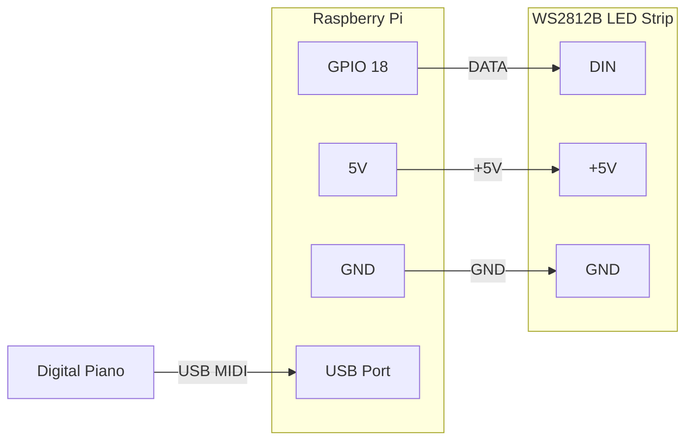

<p align="center">
  
</p>

<h1 align="center">LEDsplay</h1>

<p align="center"><strong>Turn your piano into an interactive LED learning system.</strong></p>

<!-- TODO: Hero GIF/video tutaj — najlepiej 10-15s nagranie gry z podświetlanymi klawiszami -->
<!-- Przykład:  -->


LEDsplay connects your digital piano to an LED strip via MIDI on a Raspberry Pi. Every key lights up in real time as you play. Learn songs, practice scales, play games — all controlled from a web app on your phone, tablet, or computer.

<!-- TODO: screenshot aplikacji webowej na telefonie/tablecie obok pianina z LED -->

---

## Features

### Real-time LED visualization — FREE
Every key lights up instantly as you press it. Customizable colors for left and right hand, background gradients, and brightness control.

### LED animations — FREE
Rainbow, Sparkle, Gradient, Bubble, Tetris, Police, Random — each with adjustable speed, brightness, and custom color presets.

### Song learning with LED guides
Load MIDI or MusicXML files and follow the lights. Adjust tempo (0.5x–2x), practice hands separately, loop difficult sections.
5 demo songs included free. Upload your own with the paid version.

<!-- TODO: GIF trybu nauki — klawisze podświetlane przed zagraniem -->

### Sheet music display
See real music notation in the browser (powered by OpenSheetMusicDisplay) with notes highlighted as you play.

### Scale & note training
Practice all major scales with LED visualization. Learn to read notes with visual or audio mode, 3 difficulty levels, and a hint system.

### Piano games
Reaction Game, Piano Battle (2-player competitive), LED Keeper — interactive games that turn practice into play.

### Web interface
Control everything from your phone, tablet, or any browser. Built with Angular + Ionic for a native app feel.

---

## Free vs Paid

The free version works forever — no time limit, no account needed.

| | Free | Paid ($49 one-time) |
|---|:---:|:---:|
| Real-time key lighting | ✅ | ✅ |
| All LED animations | ✅ | ✅ |
| 5 demo songs | ✅ | ✅ |
| Upload your own songs (MIDI/MusicXML) | ❌ | ✅ |
| Sheet music display | ❌ | ✅ |
| Scale & note learning | ❌ | ✅ |
| Piano games | ❌ | ✅ |
| MIDI recording & playback | ❌ | ✅ |
| All future features | ❌ | ✅ |

**No subscription.** Pay once, own it forever. No monthly fees, no cloud dependency — LEDsplay runs entirely on your Raspberry Pi.

14-day free trial gives you full access to everything. No credit card needed.

**[Get LEDsplay](https://ledsplay.lemonsqueezy.com)** | Up to 3 devices per license

---

## What you need

### Hardware

| Part | Details | Est. cost |
|------|---------|-----------|
| Raspberry Pi | Zero 2W, 4B, or 5 | $15–75 |
| WS2812B LED strip | 144 LEDs/m, individually addressable | $8–15 |
| Digital piano | Any piano/keyboard with **USB MIDI** output | — |
| USB cable | Type depends on your piano (usually USB-B to USB-A) | $3–5 |
| Power supply | Depends on your Pi model and setup — see [Power & brightness](#power--brightness) | $5–15 |
| Jumper wires | 3 wires: GPIO 18 (data), 5V (power), GND (ground) | $1–2 |

**Estimated total (without piano): $50–110** depending on what you already have.

### Wiring diagram



<!-- TODO: Sekcja montażu — zdjęcia krok po kroku:
1. Przylutuj/przylącz 3 przewody do taśmy LED (DIN, 5V, GND)
2. Podłącz przewody do GPIO Raspberry Pi (pin 18, 5V, GND)
3. Zamontuj taśmę LED nad/pod klawiszami (np. profil aluminiowy, taśma dwustronna)
4. Podłącz pianino przez USB
5. Uruchom instalację

Opcjonalne: link do filmiku z montażem na YouTube
-->

---

## Installation

On a fresh Raspberry Pi OS:

**1. Run the installer:**

```bash
curl -fsSL https://raw.githubusercontent.com/PabloCSScobar/ledsplay/main/setup.sh | sudo bash
```

**2. Reboot** the Raspberry Pi.

**3. Connect to LEDsplay hotspot:**

After reboot, LEDsplay creates a WiFi hotspot. Connect to it from your phone, tablet, or computer:
- Network: **LEDsplay** (or check your Pi's hostname)
- Open **http://ledsplay.local** in your browser

**4. Connect to your home WiFi:**

In the web interface, go to **System > WiFi** to scan and connect to your own network. After connecting, LEDsplay will be available at **http://ledsplay.local** on your local network.

<details>
<summary>What the installer does</summary>

- Downloads the latest release from GitHub
- Installs system dependencies (Python 3, GPIO libraries, MIDI tools)
- Sets up a Python virtual environment at `/opt/piano-leds-controller/`
- Configures GPIO and SPI for LED control
- Creates a systemd service (`midi-leds.service`) that starts on boot
- Full log at `/var/log/ledsplay-setup.log`

</details>

<details>
<summary>Manual installation</summary>

```bash
wget https://github.com/PabloCSScobar/ledsplay/releases/latest/download/ledsplay-armv7l.tar.gz
sudo tar xzf ledsplay-armv7l.tar.gz -C /opt/piano-leds-controller/
sudo systemctl enable --now midi-leds.service
```

</details>

---

## Updating

Updates are available through the web interface: **System > Updates**.

The app checks for new releases from this repository and performs safe updates with automatic rollback.

<details>
<summary>Manual update</summary>

```bash
sudo /opt/piano-leds-controller/venv/bin/python3 /opt/piano-leds-controller/updater.py update
```

</details>

---

## Service management

```bash
sudo systemctl status midi-leds.service     # Check status
sudo systemctl restart midi-leds.service     # Restart
sudo journalctl -u midi-leds.service -f      # View logs
```

---

## Power & brightness

LEDsplay is designed to run on a single shared power supply for both the Raspberry Pi and the LED strip. Brightness is managed in software to stay within safe power limits:

- Key brightness: max 30%
- Background brightness: max 25%

These values provide vivid, clearly visible lighting while keeping power draw well within the supply's capacity.

<!-- TODO: opisać warianty zasilania w zależności od modelu Pi i użycia PCB -->

---

## Tech stack

| Layer | Technology |
|-------|-----------|
| Hardware | Raspberry Pi + WS281x LED strip + MIDI USB |
| Backend | Python, Flask, SocketIO, rpi_ws281x |
| Frontend | Angular 19, Ionic 8 |
| Communication | WebSocket (real-time), REST API |
| Music parsing | Two-pass MusicXML 4.0 parser with caching |
| Languages | English, Polish (ngx-translate) |

---

## License

LEDsplay is proprietary software. Free tier available at no cost. See [pricing](#free-vs-paid) for details.
